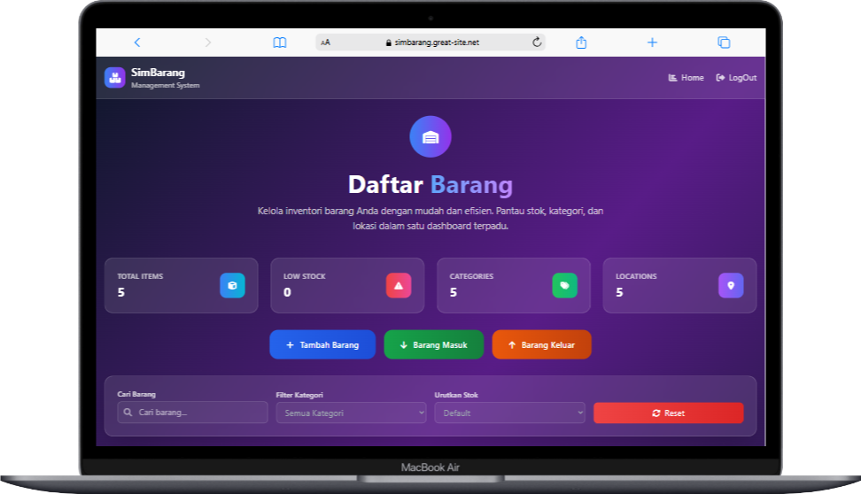

# SIMBARANG - Sistem Manajemen Inventaris Barang | Project UAS Pemrograman Web

 
 
 
  

Dokumentasi ini berisi rangkuman latihan dari mata kuliah **Pemorograman Web 2**.  
 berbagai aspek penggunaan **PHP Framework CodeIgniter 4**, mulai dari dasar hingga konsep lanjutan seperti 

ini bertujuan untuk memberikan pemahaman mendalam tentang **pengembangan aplikasi web berbasis CodeIgniter 4**, termasuk konfigurasi awal, struktur proyek, serta implementasi fitur-fitur esensial dalam sebuah aplikasi web.

---

## Anggota

| Nama | Uraian Tugas |
| -------- | --- |
| **Ahmad Ridho Septian** | Pengolahan Data dan Pengembangan FullStack Dashboard Barang  |
| **Muhammad Nurul Firdaus** | Mengatur Routing BackEnd dan Membuat Sistem Login |
| **Raditra Ikhwanul Arifin** | Membuat Halaman Home untuk Tampilan awal dan Planning Layout |
| **Muhammad Faiz Iqbal** | Penyusunan Laporan, Alur Cerita StoryBoard & Mockup |
---

## Link Demo Online

Berikut adalah link Website live dari proyek Web Artikel menggunakan **CodeIgniter 4** dan **VueJS** sebagai frontend-nya:

| **Aplikasi**        | **URL**                                                                                                              | **Deskripsi**                             |
| ------------------- | -------------------------------------------------------------------------------------------------------------------- | ----------------------------------------- |
| **SimBarang** | [https://simbarang.great-site.net/](https://ahmadridho-final.infinityfreeapp.com/)                       | Aplikasi web SimBarang dengan CodeIgniter 4 |
---

# 📦 SimBarang - Sistem Manajemen Inventaris Barang

SimBarang adalah aplikasi web berbasis **CodeIgniter 4** yang dirancang untuk membantu pengelolaan inventaris barang secara efisien, terstruktur, dan real-time. Aplikasi ini cocok digunakan di lingkungan gudang, kantor, sekolah, atau bisnis skala kecil-menengah.

---

## 🖥️ Tampilan Antarmuka

---

## 🔧 Teknologi yang Digunakan

- ⚙️ **Framework**: [CodeIgniter 4](https://codeigniter.com/)
- 💻 **Bahasa Pemrograman**: PHP
- 🗃️ **Database**: MySQL
- 🌐 **Frontend**: PHP, Tailwind CSS, CodeIgniter 4 (dengan styling modern)
- 📝 **Fitur CRUD**: Create, Read, Update, Delete untuk data inventaris

---

## 📄 Lisensi

Proyek ini dibuat untuk keperluan tugas kuliah dan tidak untuk tujuan komersial.
Silakan gunakan sebagai referensi pembelajaran.

---